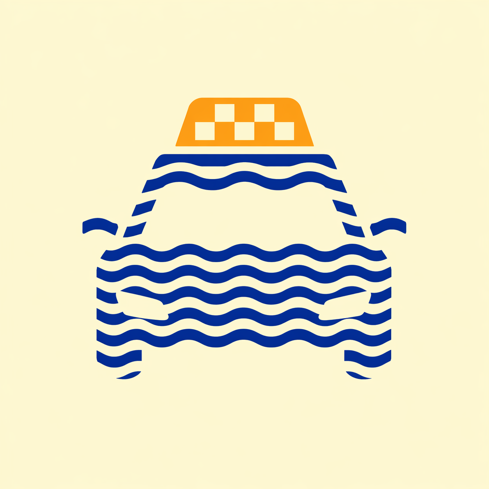

<div align="center">



# 🚖 Taxi Jerez 24H

### *Tu taxi de confianza en Jerez de la Frontera · 24 horas, 7 días a la semana*

<br>

[](https://taxijerez24h.lovable.app)
[](https://wa.me/34691312782)
[](mailto:Taxijerez24h@gmail.com)

<br>


</div>

---

## ✨ Sobre el proyecto

**Taxi Jerez 24H** es la web oficial de un servicio profesional de taxi en **Jerez de la Frontera**, disponible las **24 horas del día**.
Ofrecemos traslados al aeropuerto, viajes interurbanos, vehículos de **7 y 9 plazas** y **taxis adaptados** para personas con movilidad reducida.

> *"Viaja cómodo, seguro y a precio cerrado por toda Andalucía."*

<br>

<table>
  <tr>
    <td align="center" width="33%">
      <br>
      <sub><b>Catedral de Jerez</b></sub>
    </td>
    <td align="center" width="33%">
      <br>
      <sub><b>Alcázar de Jerez</b></sub>
    </td>
    <td align="center" width="33%">
      <br>
      <sub><b>Bodegas centenarias</b></sub>
    </td>
  </tr>
</table>

---

## 🚗 Servicios

| Servicio | Descripción |
|---|---|
| ✈️ **Traslados al aeropuerto** | Jerez · Sevilla · Málaga, con la máxima puntualidad |
| 🏙️ **Servicios urbanos** | Desplazamientos rápidos por Jerez de la Frontera |
| 🛣️ **Interurbanos** | Cádiz, Sevilla, Málaga, Tarifa… ¡incluso París si hace falta! |
| 👨‍👩‍👧‍👦 **7 plazas** | Monovolumen ideal para familias y grupos medianos |
| 👥 **9 plazas** | Vehículos para grupos grandes, eventos y excursiones |
| ♿ **Taxi adaptado** | Vehículos accesibles para personas con movilidad reducida |

---

## 🌟 Características de la web

- 🎨 **Diseño moderno y responsive** — perfecto en móvil, tablet y desktop
- 🌍 **Multiidioma** — Español 🇪🇸 · English 🇬🇧 · Deutsch 🇩🇪 · Français 🇫🇷 · 中文 🇨🇳
- 🧮 **Calculadora de precio** — estimación instantánea por kilómetros
- 💬 **Botones flotantes** — WhatsApp y calculadora siempre accesibles
- ✨ **Animaciones al hacer scroll** — experiencia fluida y elegante
- 🔍 **SEO optimizado** — JSON-LD, sitemap, hreflang y Open Graph completos
- 📞 **Contacto directo** — formulario de reserva, llamada y WhatsApp en un clic

---

## 🛠️ Tecnologías

<div align="center">


</div>

---

## 🚀 Empezar en local

```bash
# 1. Clona el repositorio
git clone <YOUR_GIT_URL>
cd <YOUR_PROJECT_NAME>

# 2. Instala las dependencias
npm install

# 3. Arranca el servidor de desarrollo
npm run dev
```

La web estará disponible en `http://localhost:5173` ⚡

---

## 📁 Estructura del proyecto

```
src/
├── assets/            # Imágenes y SVG locales
├── components/        # Componentes React (Hero, Servicios, Tarifas, Footer…)
│   └── ui/            # Componentes base de shadcn/ui
├── hooks/             # Custom hooks (useScrollReveal, use-mobile…)
├── i18n/              # Traducciones (ES · EN · DE · FR · ZH)
├── pages/             # Páginas (Index, NotFound)
└── index.css          # Sistema de diseño (tokens HSL)
```

---

## 🎨 Sistema de diseño

La web utiliza un **sistema de tokens semánticos** definido en `src/index.css` y `tailwind.config.ts`:

| Token | Uso |
|---|---|
| `--primary` | Azul corporativo (`220 72% 36%`) — botones principales y acentos |
| `--secondary` | Naranja taxi (`34 92% 50%`) — precios destacados y CTAs |
| `--background` | Crema cálido (`48 100% 97%`) — fondo principal |
| `--card` | Blanco puro — tarjetas y superficies elevadas |

> ✅ Modo claro forzado en toda la web para una experiencia consistente.

---

## 📬 Contacto

<div align="center">

| | |
|---|---|
| 📞 **Teléfono** | [+34 691 31 27 82](tel:+34691312782) |
| 💬 **WhatsApp** | [Chatear ahora](https://wa.me/34691312782) |
| 📧 **Email** | [Taxijerez24h@gmail.com](mailto:Taxijerez24h@gmail.com) |
| 📍 **Ubicación** | Jerez de la Frontera, Cádiz · España |
| 🕐 **Horario** | 24 horas · 7 días a la semana |

</div>

---

<div align="center">

### 🚖 *Taxi Jerez 24H — Donde quieras, cuando quieras*

<sub>Imágenes de Jerez vía <a href="https://commons.wikimedia.org/wiki/Category:Jerez_de_la_Frontera">Wikimedia Commons</a> · Hecho con ❤️ en Andalucía</sub>

<br>

[](https://lovable.dev)

</div>
